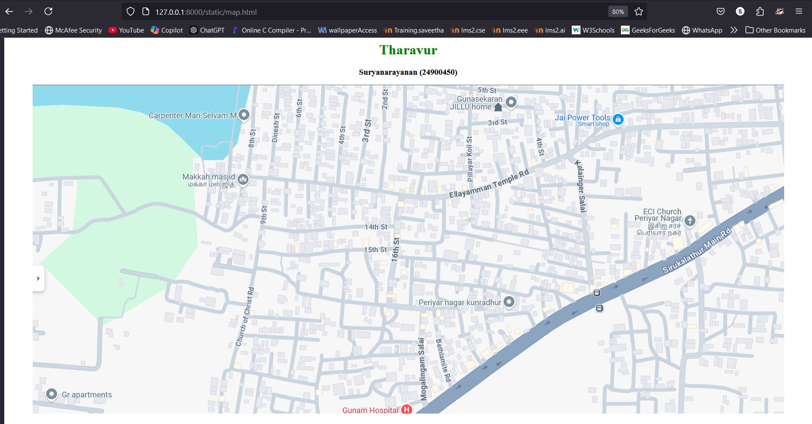
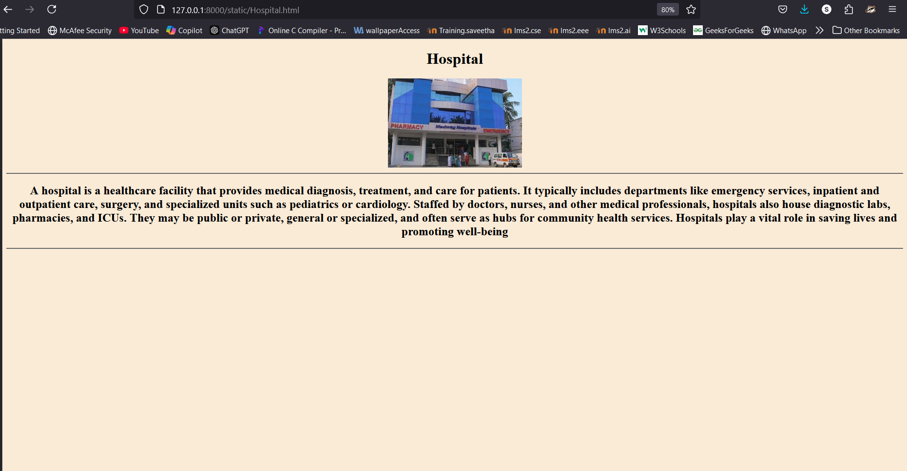
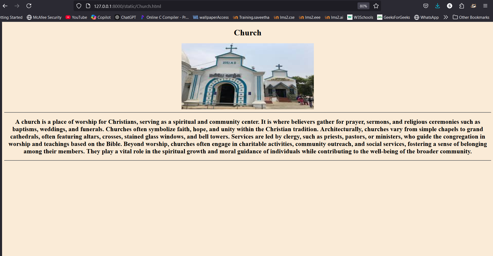
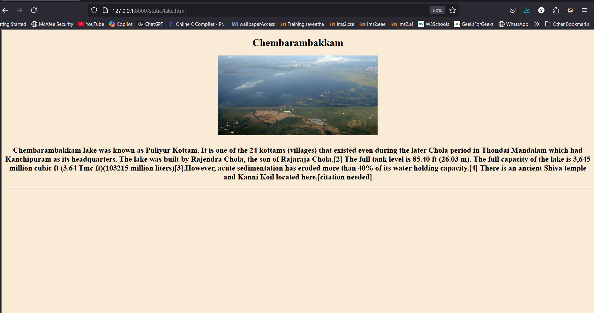
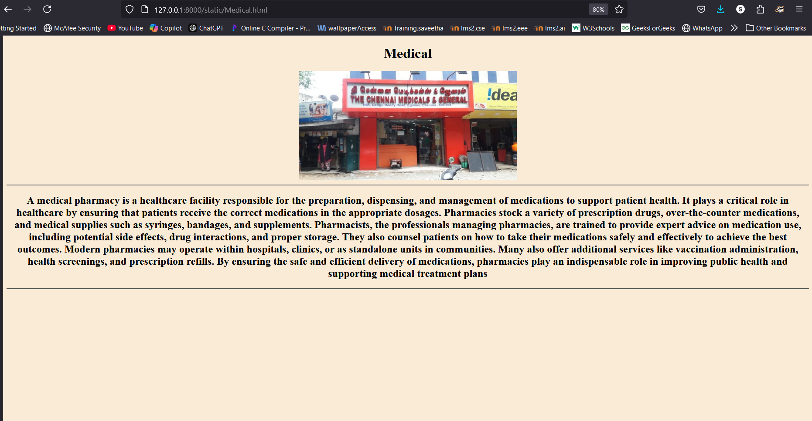

# Ex04 Places Around Me
## Date: 

## AIM
To develop a website to display details about the places around my house.

## DESIGN STEPS

### STEP 1
Create a Django admin interface.

### STEP 2
Download your city map from Google.

### STEP 3
Using ```<map>``` tag name the map.

### STEP 4
Create clickable regions in the image using ```<area>``` tag.

### STEP 5
Write HTML programs for all the regions identified.

### STEP 6
Execute the programs and publish them.

## CODE
```
map.html

<html>
<head>
<title>My City</title>
</head>
<body>
<h1 align="center">
<font color="green"><b>Tharavur</b></font>
</h1>
<h3 align="center">
<font color="black"><b>Suryanarayanan (24900450)</b></font>
</h3>
<center>
    

    <map name="image-map">
        <area target="" alt="Hospital" title="Hospital" href="Hospital.html" coords="891,755,683,706" shape="rect">
        <area target="" alt="BusStop" title="BusStop" href="BusStop.html" coords="1260,448,1339,541" shape="rect">
        <area target="" alt="Medical" title="Medical" href="Medical.html" coords="865,576,918,668" shape="rect">
        <area target="" alt="Lake" title="Lake" href="Lake.html" coords="2,1,502,172" shape="rect">
        <area target="" alt="Church" title="Church" href="Church.html" coords="1394,265,1554,351" shape="rect">
    </map>
</center>
</body>
</html>

Hospital.html

<!DOCTYPE html>
<html>
    <head>
        <title>
            Hospital
        </title>
    </head>
    <body style="background-color: antiquewhite; text-align: center;">
        <h1>Hospital</h1>
        
        <hr>
        <h2>A hospital is a healthcare facility that provides medical diagnosis, treatment, and care for patients. It typically includes departments like emergency services, inpatient and outpatient care, surgery, and specialized units such as pediatrics or cardiology. Staffed by doctors, nurses, and other medical professionals, hospitals also house diagnostic labs, pharmacies, and ICUs. They may be public or private, general or specialized, and often serve as hubs for community health services. Hospitals play a vital role in saving lives and promoting well-being</h2>
        <hr>
    </body>
</html> 

Church.html

<!DOCTYPE html>
<html>
    <head>
        <title>
            Church
        </title>
    </head>
    <body style="background-color: antiquewhite; text-align: center;">
        <h1>Church</h1>
        
        <hr>
        <h2>
            A church is a place of worship for Christians, serving as a spiritual and community center. It is where believers gather for prayer, sermons, and religious ceremonies such as baptisms, weddings, and funerals. Churches often symbolize faith, hope, and unity within the Christian tradition.

Architecturally, churches vary from simple chapels to grand cathedrals, often featuring altars, crosses, stained glass windows, and bell towers. Services are led by clergy, such as priests, pastors, or ministers, who guide the congregation in worship and teachings based on the Bible.

Beyond worship, churches often engage in charitable activities, community outreach, and social services, fostering a sense of belonging among their members. They play a vital role in the spiritual growth and moral guidance of individuals while contributing to the well-being of the broader community.
        </h2>
        <hr>
    </body>
</html> 

lake.html

<!DOCTYPE html>
<html>
    <head>
        <title>
            Chembarambakkam 
        </title>
    </head>
    <body style="background-color: antiquewhite; text-align: center;">
        <h1>Chembarambakkam</h1>
        
        <hr>
        <h2>Chembarambakkam lake was known as Puliyur Kottam. It is one of the 24 kottams (villages) that existed even during the later Chola period in Thondai Mandalam which had Kanchipuram as its headquarters. The lake was built by Rajendra Chola, the son of Rajaraja Chola.[2]

            The full tank level is 85.40 ft (26.03 m). The full capacity of the lake is 3,645 million cubic ft (3.64 Tmc ft)(103215 million liters)[3].However, acute sedimentation has eroded more than 40% of its water holding capacity.[4] There is an ancient Shiva temple and Kanni Koil located here.[citation needed] 
        </h2>
        <hr>
    </body>
</html>


Medical.html

<!DOCTYPE html>
<html>
    <head>
        <title>
            Medical
        </title>
    </head>
    <body style="background-color: antiquewhite; text-align: center;">
        <h1>Medical</h1>
        
        <hr>
        <h2>
            A medical pharmacy is a healthcare facility responsible for the preparation, dispensing, and management of medications to support patient health. It plays a critical role in healthcare by ensuring that patients receive the correct medications in the appropriate dosages. Pharmacies stock a variety of prescription drugs, over-the-counter medications, and medical supplies such as syringes, bandages, and supplements.

Pharmacists, the professionals managing pharmacies, are trained to provide expert advice on medication use, including potential side effects, drug interactions, and proper storage. They also counsel patients on how to take their medications safely and effectively to achieve the best outcomes.

Modern pharmacies may operate within hospitals, clinics, or as standalone units in communities. Many also offer additional services like vaccination administration, health screenings, and prescription refills. By ensuring the safe and efficient delivery of medications, pharmacies play an indispensable role in improving public health and supporting medical treatment plans   
        </h2>
        <hr>
    </body>
</html> 

BusStop.html

<!DOCTYPE html>
<html>
    <head>
        <title>
            Bus stop
        </title>
    </head>
    <body style="background-color: antiquewhite; text-align: center;">
        <h1>Bus stop</h1>
        
        <hr>
        <h2>
            A bus stop is a designated location where buses pick up and drop off passengers along their routes. It is a key component of public transportation systems, helping connect people to various destinations, such as schools, workplaces, and markets. Bus stops are usually marked with signs displaying route numbers, schedules, and other information.

Many bus stops are equipped with seating, shelters, and lighting to provide comfort and safety for waiting passengers. In urban areas, they may also include electronic displays showing real-time arrival times. Accessibility features, such as ramps or tactile indicators, are often provided for individuals with disabilities.

Bus stops play a crucial role in making public transport efficient and convenient, encouraging eco-friendly travel and reducing traffic congestion. They serve as essential points for commuters to access affordable and reliable transportation services
        </h2>
        <hr>
    </body>
</html> 


```

## OUTPUT







## RESULT
The program for implementing image maps using HTML is executed successfully.
